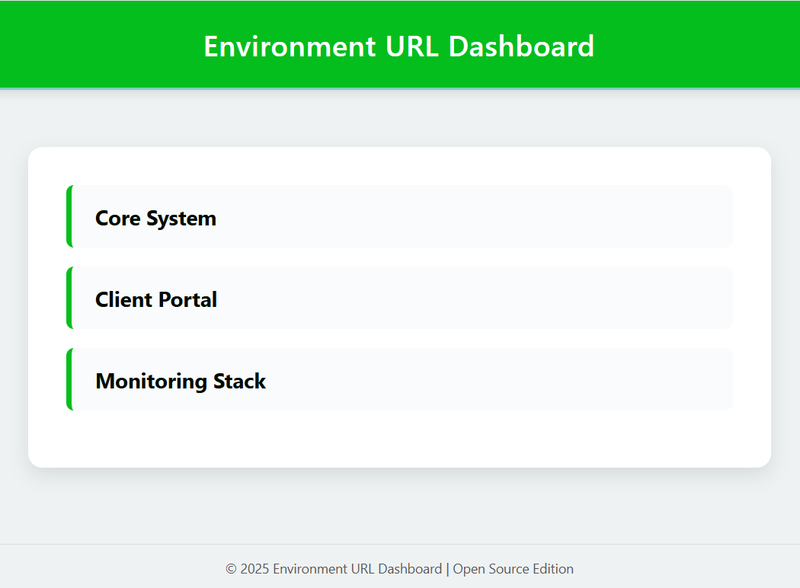
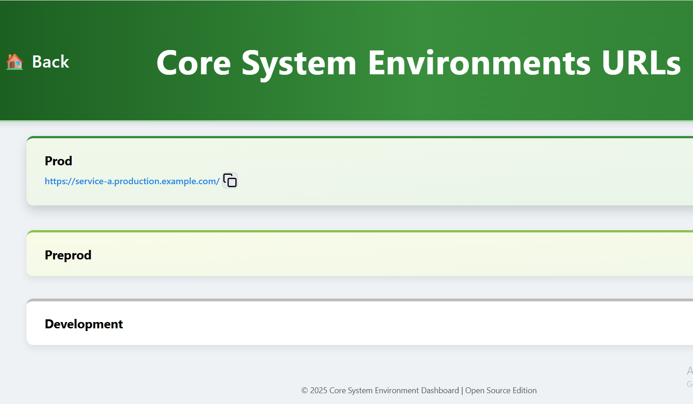

# Unified Environment Dashboard (Core System / Client Portal / Monitoring Stack)

This project provides a **centralised dashboard** that displays environment URLs for multiple systems, specifically `core-system`, `client-portal`, and `monitoring-stack`, across different deployment environments (`prod`, `preprod`, `develop`). The dashboard is automatically generated and deployed to Kubernetes, where it is served via NGINX.

---

## Project Structure

```bash
environment-dashboard/
│
├── core-system/              # Core system environment URLs and config
├── client-portal/            # Client portal environment URLs and config
├── monitoring-stack/         # Monitoring and observability system URLs
│
├── deployment/
│   ├── core-generate-index.py        # HTML generator for Core System
│   ├── portal-generate-index.py      # HTML generator for Client Portal
│   ├── monitoring-generate-index.py  # HTML generator for Monitoring Stack
│   ├── deployments.yaml              # Kubernetes deployment & service config
│   └── index.html                    # Root landing/redirect HTML
│
└── .gitlab-ci.yml                    # GitLab CI/CD pipeline configuration
```

### 🔗 How to Add a New URL

To add a new service or system URL, follow these steps:
1️⃣ Choose the correct environment folder

Determine which system the URL belongs to:

- `core-system/`

- `client-portal/`

- `monitoring-stack/`

2️⃣ Select the correct environment YAML file

- `prod.yaml` → Production environment

- `preprod.yaml` → Pre-production / Testing environment

- `develop.yaml` → Development environment

3️⃣ Add the new URL entry

Example modification in prod.yaml:

```bash
prod:
  - https://example-service-prod.company.local/
  - https://new-service-prod.company.local/   # ✅ Newly added URL
```

4️⃣ Push your changes to GitLab
5️⃣ CI/CD Pipeline executes automatically
The pipeline will:

- Generate updated HTML index files

- Update Kubernetes ConfigMaps

- Restart the dashboard deployment

6️⃣ Open the Dashboard to verify

After deployment completes, open:

🔗 **Unified Environment Dashboard:**

[http://environment-urls.your-domain/](http://environment-urls.your-domain/)


### **Example Dashboard Pages**

**Main Overview Page**


**Core System Page**
